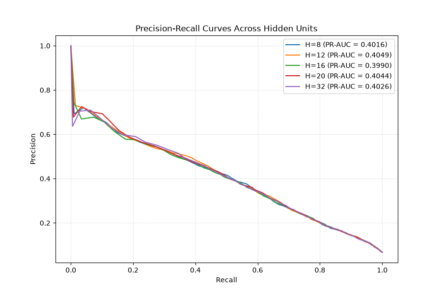
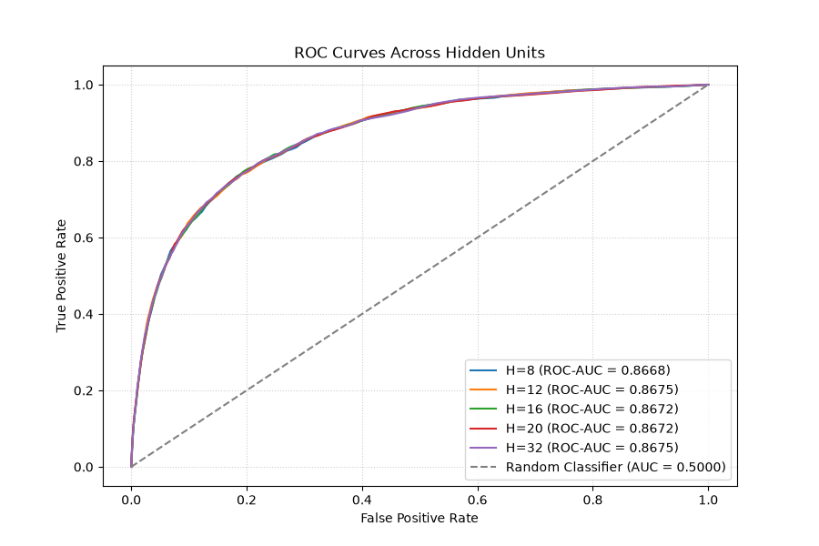

# Credit-Risk-MLP

# Description
A credit risk python project evaluating borrower default probability on Kaggle's Give Me Some Credit dataset. Built a custom 2-layer MLP from scratch only in NumPy without the use of external machine learning libraries. Opted for LeakyReLU activations, Momentum GD use of weighted class loss to help with heavy class imbalance. Model architectures were benchmarked over a variety hidden layer amounts, H = 8, 12, 16, 20, 32, and compared/evaluated using ROC-AUC and Precision-Recall metrics, combined with LOFO feature pruning, explainability function for rejected data samples and new engineered non linear features.

# Objective
The objective was to understand how an MLP works behind the scenes by fully deriving all the backpropagation gradients and feature contributions', then demonstrating how those results work in to solve an applied problem using only linear algebra.

# My Aproach
1) Cleaned the data: imputed missing values with median (so to exclude outliers), took ln(1+x) of heavily skewed features such as income so when normalised the data points are more distinguishable, engineered new non linear features to help the model more easily find non linear combinations, split the data into a training and validation sets and used training mean and standard deviations to normalise data in both sets to prevent data leakage.
2) Create Model logic: used a Leaky ReLu activation function to prevent initial weights from causing the gradient of the feature to be set to 0. Implemented the sigmoid, Loss, gradient all manually, and train function with early stopping after 20 non significant increases to prevent overfitting.
3) Wrote the optimiser classes, standard gradient descent and with momentum all with different batch sizes. Chose to write as a class so the momentum can be stored as a class attribute.
4) Built the evaluation functions. Decided on using Precision recall plot as well as Recall - false positive rate in order to provide a metric that doesn't include true negatives since there is a heavy class imbalance with only 6.7 % of data being positives, Iterated oved hidden features to test if network capacity was a bottleneck and ran a small grid search on learning rate and batch size hyperparameters as an attempt to tune the model. Found an optimal decision threshold by inputting parameters for expected monetary cost of false negatives (Defaulted on loan) and false positives (refuse to lend) then returned the threshold that minimises the overall cost.
5) Finally added an function that explains the top three contributing factors to a rejection. Derived a result that affectively reduces two layer MLP into a "linear" equation weights multiplied by each feature plus a constant term at the end.

# Results
## Hyperparameter Optimization Results

A $3 \times 3$ grid search was executed across learning rates ($\eta \in \{0.001, 0.01, 0.1\}$) and mini-batch sizes ($B \in \{128, 256, 512\}$) with early stopping enabled across 1,000 max epochs.

| Learning Rate ($\eta$) | Batch Size | Validation Loss | PR-AUC | ROC-AUC | Stopped Epoch |
| :--- | :--- | :--- | :--- | :--- | :--- |
| **0.100** | **512** | **0.8550** | **0.4069** | **0.8688** | **56** |
| 0.100 | 128 | 0.8596 | 0.4048 | 0.8684 | 37 |
| 0.010 | 512 | 0.8567 | 0.3999 | 0.8683 | 162 |
| 0.010 | 128 | 0.8571 | 0.4051 | 0.8681 | 79 |
| 0.100 | 256 | 0.8586 | 0.4071 | 0.8680 | 39 |
| 0.001 | 128 | 0.8583 | 0.4049 | 0.8675 | 408 |
| 0.001 | 512 | 0.8602 | 0.3989 | 0.8671 | 580 |
| 0.010 | 256 | 0.8596 | 0.4041 | 0.8671 | 183 |
| 0.001 | 256 | 0.8633 | 0.3984 | 0.8661 | 497 |

### Observations and Analysis

1. **Convergence Speed:** Higher learning rates ($\eta = 0.1$) resulted in much quicker convergence in under 60 epochs, compared to 400+ epochs required by $\eta = 0.001$, This hints that our loss surface around the minimum is smooth and flattish since a a relively high leanring rate is converging effictlvey and early stopping is stoppng the osclilation and the momentum optimiser is effecvley speedingup the traversal of flater loss areas.
2. **Performance Stability:** The model's ROC-AUC is consistently around (~0.866–0.869) across all parameter spaces, demonstrating that the features and weighted loss increase optimisation more than tuning learning rate.
3. **Imbalance Metrics:** The ~0.868 ROC-AUC versus the much lower ~0.407 PR-AUC demonstrates the necessity of tracking Precision-Recall curves under heavy class imbalance (~6.7% default rate), where standard ROC-AUC can present an overly optimistic representation of true positive detection.

### Model Capacity Sweep (Hidden Layer Units)

To determine optimal network capacity, the model was evaluated across hidden layer dimensions $H \in \{8, 12, 16, 20, 32\}$ using fixed optimal optimization settings ($\eta = 0.01$, $B = 512$, Momentum $\beta = 0.9$).

| Hidden Units ($H$) | Stopped Epoch | Validation Loss | PR-AUC | ROC-AUC | Primary Trait |
| :--- | :--- | :--- | :--- | :--- | :--- |
| **8** | 165 | 0.8609 | 0.4016 | 0.8668 | Minimal baseline capacity |
| **12** | **163** | **0.8588** | **0.4049** | **0.8675** | **Peak PR-AUC (Best Imbalance Performance)** |
| **16** | 178 | 0.8608 | 0.3990 | 0.8672 | Standard baseline |
| **20** | **158** | **0.8587** | **0.4044** | **0.8672** | **Lowest Validation Loss** |
| **32** | **154** | **0.8588** | **0.4026** | **0.8675** | **Peak ROC-AUC** |

#### Analysis

1. **Capacity** Increasing capacity from $H = 8$ to $H = 32$ multiplies the hidden layer parameters by 4 but ha no substantial gain in ROC-AUC (~0.8668 to ~0.8675) or loss reduction. This confirms that netwrok capacity is not a bottleneck and having less hidden features is simpler and achieves similar results.
2. **Optimal Selection ($H = 12$ or $H = 20$):** $H = 12$ yields the highest Precision-Recall AUC (0.4049), making it the most practical choice because credit scoring requires high true positive identification rate since cost of false negative is high.

### Visuals produced across hidden architectures

To visualize how network capacity affects ranking quality across decision thresholds, Precision-Recall (PR) and Receiver Operating Characteristic (ROC) curves were generated for each hidden dimension $H \in \{8, 12, 16, 20, 32\}$.

